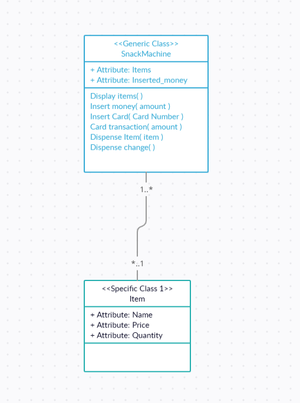

# This is a Simple Snacks Vending Machine Application #

--------------------------
language: python 3.9

--------------------------

######
Quick Start

clone the repo
change the directory on terminal to "vending machine"

run the following command:

python snackMachine.py
or
python3 snackMachine.py

######

#The design was built on the following UML #

turned into the following code skeleton

###############################
# important Note #
To acsess Control mode Enter the password which is 12345678
